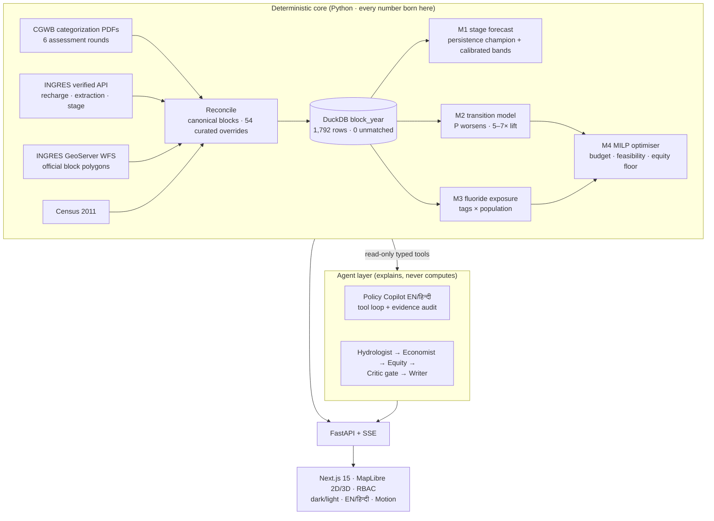

<div align="center">

# JAL · जल
### Rajasthan Groundwater Intelligence Platform

**[🌐 Live demo](https://jal-rajasthan.vercel.app)** · demo access code: `JAL2026`

[](https://jal-rajasthan.vercel.app)
[](https://github.com/krish2105/Jal-Rajsthan-Project-/actions)
[](pyproject.toml)
[](web/package.json)
[-16a34a)](data/raw)
[](docs/EXECUTIVE-BRIEF.md)

*Block-level groundwater **diagnosis → forecast → exposure → prescription** for all
302 assessed blocks of Rajasthan — with a bilingual (EN/हिन्दी) agentic AI layer
whose every number traces to a deterministic model.*

</div>

---

> **Headline.** At an identical ₹600-crore MGNREGA budget, the MILP-optimised
> recharge plan buys **+69% more risk-weighted recharge than uniform allocation**,
> while guaranteeing ≥25% of spend reaches fluoride-affected blocks. The model's
> top-50 "likely to worsen" watchlist is **5–7× sharper than chance**.

## Why this exists

Rajasthan knows it has a groundwater crisis — **213 of 302 blocks over-exploited**
(GWRA 2025), extraction ≈1.5× recharge, **68 blocks officially fluoride-tagged**
(~1.17 crore people). What no dashboard answers is the allocative question:
**given a fixed MGNREGA water-works budget, which recharge structures in which
blocks buy the most future water and avert the most exposure per rupee?**
JAL answers it, end to end, on official data only.

## Architecture



## Proof over promises

| Claim | Where it's enforced |
|---|---|
| 2022 parse = published split (302 = 219/22/20/38/3) **exactly** | hard assert in parser + `tests/test_reconciliation.py` (CI) |
| PDF parses match the independent INGRES API, every year | ingest cross-check (295/295/302/302) |
| No leakage: expanding-window time-series splits only | backtest code + spec §10 |
| The ML challenger lost to persistence — **we shipped persistence** | `reports/m1_backtest.md` (honesty is the feature) |
| Agents cite or die: numeric claims audited against tool evidence | `src/jal/agents/copilot.py` audit + critic rules |
| Every source manifested with URL + SHA-256 | `data/raw/*/SOURCE.md` |
| A studio never answers for a block you didn't pick | `web/e2e/jal.spec.ts` selection test |
| WCAG 2.1 AA contrast and keyboard reach on every screen | `web/e2e/a11y.spec.ts` (axe, CI) |

## The product

**🗺 Dashboard** — 302 official polygons, 10 lenses (category / stage / trend /
P(worsens) / fluoride), 2D↔3D extrusion · **📊 District scorecard** — 33 districts,
sortable KPIs · **📋 Priority plan** — ₹/hectare-metre ranked, structure mixes ·
**🎛 Scenario studio** — budget × equity × rainfall, optimiser re-runs ·
**🤖 Agent theater** — five specialists + critic, reasoning streamed live ·
**💬 Policy Copilot** — bilingual, evidence-cited answers · **📒 Works ledger** — sanctioned → built → verified, edits gated by Postgres RLS ·
**🔔 Notification centre** — model-generated anomaly + watchlist feed ·
**🎙 Voice copilot** — hi-IN/en-IN dictation · **🔍 Transparency** —
the eval numbers, including where we lost · **🔐 RBAC** — Secretary / District
Officer (district-scoped) / Analyst roles ([SECURITY.md](SECURITY.md)) ·
**⌘K command palette** — jump to any of the 302 blocks, 33 districts or any
section · **🧭 Guided tour** — an eight-step walkthrough of the argument, in
English or Hindi · **📶 Offline shell** — installable PWA; pages already opened
survive the patchy connectivity of a Barmer field visit.

## Run it

```bash
scripts/run_local.sh        # API + web; live agents if Ollama is running
```

<details>
<summary>Pipeline commands (reproduce everything from raw data)</summary>

```bash
uv run python -m jal.ingest.ingres --years 2022-2023   # official API pull
uv run python -m jal.ingest.cgwb                       # PDF parse + ground-truth gate
uv run python -m jal.reconcile.blocks                  # identity reconciliation
uv run python -m jal.panel.build                       # DuckDB panel + quality report
uv run python -m jal.models.m1_stage                   # forecasts + backtests
uv run python -m jal.models.m2_transitions             # transition model
uv run python -m jal.models.m3_fluoride                # exposure layer
uv run python -m jal.optimise.milp                     # ₹600 Cr plan vs baselines
uv run python -m jal.export.web                        # dashboard data
uv run python -m jal.agents.record_replays             # record real agent runs
uv run pytest                                          # ground-truth gates
```
</details>

## Documents

[Executive brief](docs/EXECUTIVE-BRIEF.md) · [90-second demo script](docs/DEMO-SCRIPT.md) ·
[Security posture](SECURITY.md) · [Master roadmap](docs/ROADMAP.md) ·
[Original spec](docs/02-JAL-spec.md) · [Eval report](reports/eval_latest.md) ·
[Data quality](reports/data_quality.md)

## Honesty ledger

Assessment years are irregular · boundary vintages differ across the 2023
reorganisation (crosswalked, flagged) · fluoride tags are categorical (station
kriging pending India-WRIS) · structure yields are stated design assumptions — the
**ranking** is the defensible output · no causal claims without the
difference-in-differences design in the [roadmap](docs/ROADMAP.md) · the hosted
demo has no LLM, so the agent theatre and WSP studio replay **only the blocks
whose runs are recorded in `replays.json`** — they now say so plainly rather than
substituting another block's briefing; point `OPENAI_BASE_URL` at any
OpenAI-compatible endpoint (or run Ollama locally) to draft all 302 live.

<div align="center">
<sub>Built on public data for the people of Rajasthan · deterministic models decide, AI explains</sub>
</div>
